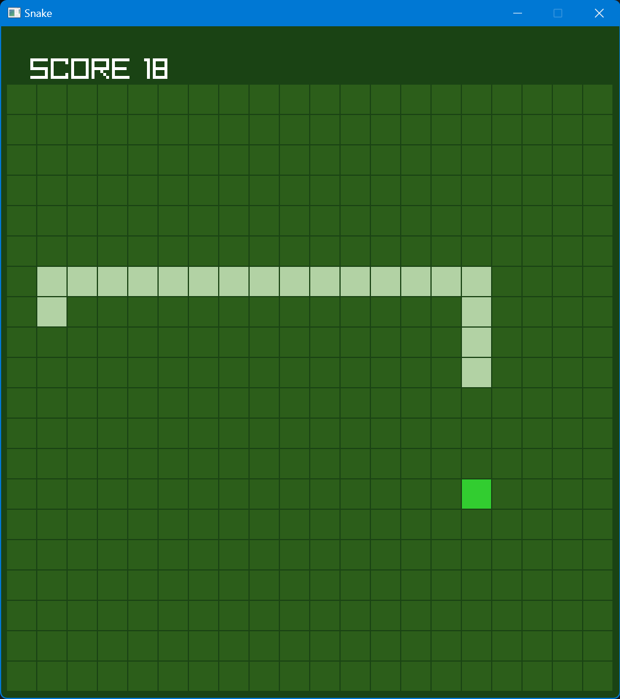

# Raylib_Snake
---

### What is this?
* This was a simple project that was meant to learn the basics of raylib, a graphics library for C++. There isn't much to say about it - ***It's snake***. The user controls a snake that moves around a grid, consuming "treats" by passing over them. If the snake collides with itself, the snake will reset to just one segment.
### What was used?
* RayLib 5.5
* C++ 17
### Features
* **Collision Detection** - The game will reset if the snake collides with itself.
* **Score Tracking** - The score will increment with each "treat" that is consumed.
### Possible Improvements
* Add a title screen, with settings to select a color theme.
* Add a pause button.
* Add music and sound effects.
* Add a high score.
